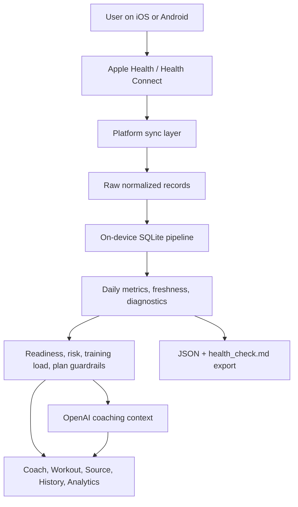

# BioStream - OpenAI Sydney Hackathon

BioStream is a privacy-first mobile training coach that turns the health data already on a user's phone into practical, conservative training guidance.

It is not a generic chat app. The app imports Apple Health data on iOS and Health Connect data on Android, normalizes it into an on-device SQLite training pipeline, builds source-aware readiness and training context, and uses OpenAI-powered coaching to explain what to do today, what to avoid, and what uncertainty remains.

The goal is simple: help people make better daily decisions about movement, recovery, and training without pretending that incomplete wearable data is more certain than it is.

BioStream is the product concept and judge-facing name. The Expo native app name is currently `Training Pipeline` while the hackathon build is still moving quickly.

## Hackathon Thesis

Most fitness apps either show dashboards or generate plans. BioStream combines both:

- Native mobile health import across iOS and Android.
- A local, inspectable health-data pipeline that preserves raw source context.
- Deterministic readiness, risk, and training-plan guardrails.
- OpenAI coaching that reasons over the local snapshot instead of inventing context.
- A hackathon engineering workflow designed around Codex agents working safely in parallel.

The hard part is not a single screen or a single model call. The hard part is stitching together native mobile permissions, messy health schemas, local persistence, conservative coaching logic, UI, tests, and AI behavior quickly enough to demo as one product.

## Why This Is Codex-Native

BioStream is the kind of project where Codex changes what is feasible during a hackathon.

Cross-platform health apps have a wide surface area: HealthKit permissions and quantity identifiers on iOS, Health Connect permissions and record types on Android, native Expo config plugins, local SQLite schemas, React Native UI, TypeScript contracts, device-preview gotchas, and OpenAI prompting boundaries. Progress depends on changing all of those layers together without breaking the pipeline.

Codex was used as an engineering multiplier for that full stack:

- Native app work: Expo React Native, HealthKit, Health Connect, Android permissions, iOS usage descriptions, dev-client guidance, and device-specific runtime checks.
- Data-platform work: schema design, ingestion normalization, source freshness, daily rollups, exports, diagnostics, and migration-safe SQLite code.
- AI-product work: onboarding coach, daily coach, deterministic plan engine, structured output boundaries, risk flags, stale-data handling, and conservative recommendation behavior.
- Quality work: focused Jest tests, TypeScript contracts, smoke tests, rollup fixtures, and review passes that check whether the product claims match the code.

The result is not "AI writes a README." The result is a mobile health product that could only move this fast because Codex could operate across native, data, UI, and AI layers while following a shared engineering contract.

## AGENTS.md As The Hackathon Operating System

The repo includes an [AGENTS.md](./AGENTS.md) file that acts as a team-specific operating agreement for Codex agents and human developers.

During the hackathon, that file is more than documentation. It encodes how work should happen:

- Dedicated worktrees per task, using branches such as `codex/<short-task>`, so multiple agents can work without overwriting each other.
- Required `git status --short --branch` and `git fetch origin` before starting, so every task begins from known repo state.
- Non-destructive git rules: no `git reset --hard`, `git clean -fd`, or reverting someone else's changes unless explicitly requested.
- Test-first defaults for code changes, with focused exceptions for docs-only or urgent hackathon changes.
- Native preview rules that distinguish regular Expo, web preview, dev-client testing, and rebuild-required native changes.
- Health-data invariants: preserve raw health data, dedupe or aggregate only in derived views, and update types, SQLite, exports, UI consumers, and diagnostics together when pipeline fields change.
- Verification expectations, including `npm run typecheck` for TypeScript changes and `git diff --check` before pushing.

This made the repo safe for fast parallel development. Instead of each agent guessing process, the workflow itself lives beside the code and constrains how Codex operates.

## Product Experience

BioStream opens with lightweight goal onboarding instead of a long form. The user can describe a goal such as getting fit again, building strength, training for an event, or returning after time off. The app then asks only the next useful question and builds a goal context during the session, with local storage support for a structured goal profile.

Once inside the app, the main surfaces are:

- Coach: a daily coaching feed with readiness, sleep/recovery context, stale-data explanations, quick replies, and OpenAI-backed conversation when an API key is available.
- Workout: a seven-day plan scaffold generated from the user's goal and current readiness, with capture hints for watch-tracked or manual sessions.
- Source: sync controls, permission diagnostics, source freshness, recent sync history, API-key settings, export, and clear-data controls.
- History: imported daily trends and workouts.
- Analytics: a local pipeline scoreboard showing which health domains are live, missing, stale, or permission-blocked.

The app is intentionally conservative. Missing data is not treated as permission to train harder. Stale sleep, HRV, resting heart rate, steps, or energy reduce confidence and push the recommendation toward safer options.

## Architecture



### 1. Native Health Import

`src/health/syncPipeline.ts` chooses the platform source at runtime:

- iOS: `src/health/appleHealth.ts` reads Apple Health / HealthKit through `@kingstinct/react-native-healthkit`.
- Android: `src/health/healthConnect.ts` reads Health Connect through `expo-health-connect` and `react-native-health-connect`.

The app imports steps, active and total energy, distance, heart rate, resting heart rate, HRV, sleep, workouts, body composition, VO2 max, nutrition, and hydration where the platform and permissions allow it.

### 2. Platform-Neutral Storage

`src/storage/trainingStore.ts` owns the on-device SQLite pipeline. It preserves raw source metadata and then builds derived coaching views.

Core tables include:

- `health_samples`: scalar samples and source metadata.
- `sleep_sessions`: sleep sessions and stage-derived details.
- `workouts`: workout summaries, sport buckets, duration, distance, HR, calories, and raw payloads.
- `nutrition_daily`: daily nutrient and hydration totals.
- `daily_metrics`: AI-facing daily rollups.
- `sync_runs`: sync history and counts.
- `health_connect_diagnostics`: Health Connect permission/read diagnostics.
- `goal_profile`: the locally persisted coaching goal profile.

The schema is designed around a key product principle: preserve raw health data first, then dedupe, aggregate, and interpret in derived tables.

### 3. Source Freshness And Diagnostics

The coach does not just ask "what is the latest metric?" It asks whether that metric is fresh enough to trust.

The pipeline tracks freshness for sleep, workouts, steps, energy, HRV, resting heart rate, nutrition, hydration, body composition, and check-ins. This feeds:

- Coach confidence and readiness status.
- UI badges for fresh, partial, stale, and missing data.
- Exported `health_check.md` summaries.
- OpenAI coaching context that explicitly lists what is known, stale, missing, or uncertain.

### 4. Readiness, Risk, And Training Plans

The deterministic coaching layer lives under `src/coach`.

Key modules:

- `readinessStatus.ts`: converts readiness scores and source freshness into green, yellow, red, or unknown status.
- `dailyRecommendation.ts`: builds recommendation fields, confidence, sources used, sources ignored, and check-in prompts.
- `riskFlags.ts`: detects safety-relevant user input such as chest pain, fainting, unusual shortness of breath, fever, significant pain, injury concerns, pregnancy-related concerns, disordered eating signals, and severe fatigue.
- `trainingLoad.ts` and `trainingState.ts`: summarize load and classify training state.
- `planEngine.ts`: creates a goal-aware seven-day plan scaffold that scales duration and intensity based on readiness and recent training.
- `schemas.ts` and `structuredCoach.ts`: define a structured output boundary so AI-backed coaching can be tested against stable contracts.

This split is deliberate. Deterministic code handles safety and data contracts. OpenAI handles natural-language interpretation, coaching judgment, trade-off explanations, and conversation.

### 5. OpenAI Coaching

`src/ai/openaiCoach.ts` sends a compact local health summary, the current deterministic plan, source-freshness data, recent workouts, recent daily metrics, and recent conversation to the OpenAI Responses API.

The coach instructions require BioStream to:

- Use only supplied local health context.
- Avoid pretending absent data exists.
- Treat stale or missing data conservatively.
- Respect deterministic plan guardrails.
- Lower intensity for pain, illness, injury, or severe fatigue.
- Avoid diagnosis or medical treatment claims.
- Keep replies concise and useful.

The onboarding flow in `src/onboarding/goalCoach.ts` uses OpenAI to discuss the user's goal and summarize early setup, with local fallback copy when no API key is present.

API keys are saved locally with SecureStore. For demos, `.env.local` can generate a local fallback key file that is ignored by git.

## Repository Map

```text
App.tsx                         App shell, tab routing, sync, coach, export, settings
app.json                        Expo config, HealthKit plugin, Health Connect permissions
src/ai/                         OpenAI coach API wrapper
src/coach/                      Readiness, risk, plan, training state, structured coach contracts
src/core/                       Shared app types, constants, formatters, conversation helpers
src/export/                     Pipeline JSON and health_check.md export builders
src/goals/                      Local goal profile types and normalization
src/health/                     Apple Health, Health Connect, and platform sync layer
src/onboarding/                 Goal onboarding, quick replies, OpenAI/local onboarding coach
src/screens/                    Coach, workout, source, history, analytics, onboarding, splash
src/storage/                    SQLite training store, app settings, web demo storage
src/styles/                     React Native styles
src/theme/                      Design tokens
src/ui/                         Shared UI primitives
docs/                           Architecture, schema, prompt, issue backlog, implementation plans
UI/BioStream/                   Design prototype and reference screens
scripts/                        Local OpenAI key generation and validation scripts
```

## What Is Built Now

- Expo React Native app with iOS, Android, and web-preview paths.
- Native HealthKit and Health Connect integration points.
- On-device SQLite training pipeline.
- Health Connect diagnostics and sync history.
- Daily rollups for coaching and analytics.
- Source freshness model for stale, missing, partial, and fresh health domains.
- Local goal onboarding plus goal profile storage support.
- OpenAI-backed onboarding and coach conversation when an API key is available.
- Local fallback behavior for demos without a live API key.
- Deterministic readiness, recommendation, risk, and plan logic.
- Pipeline export as JSON plus a human-readable `health_check.md`.
- Jest and TypeScript coverage for data, coach, UI, schema, and export boundaries.

## Demo Path

A judge can evaluate the core loop in a few minutes:

1. Start onboarding and describe a health or training goal in natural language.
2. Sync Apple Health or Health Connect data on a physical device, or use web preview for UI-only review.
3. Open Coach to see readiness, stale/missing data handling, and the recommended training direction.
4. Open Workout to see the generated seven-day plan scaffold.
5. Open Source and Analytics to inspect permissions, sync history, source freshness, and metric coverage.
6. Export the local pipeline to review the JSON snapshot and human-readable `health_check.md`.

## Current Limits

BioStream is a hackathon prototype, not a medical device.

- It gives wellness and training guidance, not diagnosis or treatment.
- It depends on permissions and data quality from Apple Health or Health Connect.
- Some native behavior must be tested in a dev client or installed build, not Expo Go.
- Web preview is useful for UI checks but does not exercise native health modules, SecureStore, HealthKit, or Health Connect.
- The AI coach is intentionally constrained by local data and deterministic guardrails.

## Run Locally

Install dependencies:

```sh
npm install
```

Regular Expo preview:

```sh
npm start -- -c
```

Fast web UI preview:

```sh
npm run web -- -c
```

Native builds:

```sh
npm run ios
npm run android
```

Dev-client path for native HealthKit / Health Connect behavior:

```sh
npm run start:dev-client -- -c
```

This app uses native health modules, so Expo Go cannot load the full native path. Use a physical device with Apple Health or Health Connect data for real health import testing. Android requires Health Connect to be installed or available through the system provider.

## Local Demo OpenAI Key

For local demos only, the app can embed an OpenAI API key into the local app bundle as a fallback. A user-saved BYO key still takes priority.

Create `.env.local` from `.env.example`:

```sh
LOCAL_EMBED_OPENAI_KEY=1
OPENAI_API_KEY=sk-your-demo-key
```

Then run:

```sh
npm run generate:local-openai-key
```

The generated file is `src/config/localOpenAiApiKey.generated.ts` and is ignored by git. Rebuild the native app after changing `.env.local`.

## Verification

```sh
npm test
npm run test:watch
npm run test:rollups
npm run test:ci
npm run typecheck
git diff --check
```

Use `npm run test:rollups` for the platform-neutral daily rollup and migration fixtures. Use device builds for any change involving native modules, config plugins, Android permissions, iOS entitlements, Health Connect, HealthKit, or SecureStore.

## Judge Notes

What to look for:

- The app is not a thin OpenAI wrapper. It has a local health-data substrate and a model-facing coaching boundary.
- The architecture handles both iOS and Android health sources through one platform-neutral pipeline.
- The coach is designed for uncertainty: stale and missing data lower confidence instead of being ignored.
- Safety logic is split from generation so serious symptoms and injury signals remain conservative.
- The README, docs, and AGENTS.md show how Codex was used not just to generate code, but to define and enforce a fast, parallel, hackathon-specific engineering workflow.

## References

- Apple HealthKit authorization: https://developer.apple.com/documentation/healthkit/authorizing-access-to-health-data
- Android Health Connect data types: https://developer.android.com/health-and-fitness/health-connect/data-types
- React Native Health Connect permissions: https://matinzd.github.io/react-native-health-connect/docs/permissions/
